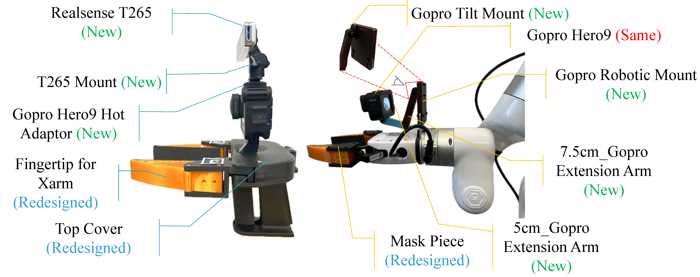

<p align="center">
Welcome to the official repository of FastUMI!
</p>

<br>
<p align="center">
<h1 align="center"><strong>Fast-UMI: A Scalable and Hardware-Independent Universal Manipulation Interface</strong></h1>
</p>

<div id="top" align="center">

[]([https://github.com/Zhefan-Xu/CERLAB-UAV-Autonomy/releases](https://github.com/zxzm-zak/AlignBot/blob/main/README.md))
[](https://opensource.org/licenses/MIT) 
[](https://releases.ubuntu.com/20.04/)
[](https://huggingface.co/datasets/cpa2001/FastUMI_Data)

[[Project page]](https://fastumi.com/)
[[Huggingface Dataset]](https://huggingface.co/datasets/IPEC-COMMUNITY/FastUMI-Data)
[[PDF (Early Version)]](https://arxiv.org/abs/2409.19499)
[[PDF (TBA)]](https://fastumi.com/)



Physical prototypes of Fast-UMI system

</div>

## 📋 Contents

- [📋 Contents](#-contents)
- [🔥 News](#-news)
- [💡 Abstract](#-abstract)
- [1. 🏠 Environment and GoPro Setup](#1--environment-and-gopro-setup)
  - [1.1 🚀 ROS Installation](#11--ros-installation)
  - [1.2 🔭 Python Environment](#12--python-environment)
  - [1.3 🛒 Install the necessary ROS packages](#13--install-the-necessary-ros-packages)
  - [1.4 📺 Intel RealSense Dependencies](#14--intel-realsense-dependencies)
  - [1.5 📷 GoPro Setup](#15--gopro-setup)
- [2. 📝 Workflow](#2--workflow)
  - [2.1 🌏 Start ROS Core](#21--start-ros-core)
  - [2.2 🪢 Connect RealSense T265 and GoPro](#22--connect-realsense-t265-and-gopro)
  - [2.3 🎇 Open RViz for Visualization](#23--open-rviz-for-visualization)
  - [2.4 🏷️ Run Data Collection Script](#24-️-run-data-collection-script)
- [3. 📚 Data Processing Details](#3--data-processing-details)
  - [3.1 🤝 Trajectory Transformation](#31--trajectory-transformation)
  - [3.2 📸 Gripper Width Detection](#32--gripper-width-detection)
  - [3.3 🏹 Inverse Kinematics (IK) Computation](#33--inverse-kinematics-ik-computation)
  - [3.4 🎄 Different Types of Data Processing](#34--different-types-of-data-processing)
- [4. 📠 File and Data Structure Description](#4--file-and-data-structure-description)
  - [4.1 📖 File Structure](#41--file-structure)
  - [4.2 📜 Data Structure](#42--data-structure)


## 🔥 News
- [2024-12] We released Data Collection Code and Dataset.

## 💡 Abstract

Collecting real-world manipulation trajectory data involving robotic arms is essential for developing general-purpose action policies in robotic manipulation, yet such data remains scarce. Existing methods face limitations such as high costs, labor intensity, hardware dependencies, and complex setup requirements involving SLAM algorithms. In this work, we introduce Fast-UMI, an interface-mediated manipulation system comprising two key components: a handheld device operated by humans for data collection and a robot-mounted device used during policy inference. Our approach employs a decoupled design compatible with a wide range of grippers while maintaining consistent observation perspectives, allowing models trained on handheld-collected data to be directly applied to real robots. By directly obtaining the end-effector pose using existing commercial hardware products, we eliminate the need for complex SLAM deployment and calibration, streamlining data processing. Fast-UMI provides supporting software tools for efficient robot learning data collection and conversion, facilitating rapid, plug-and-play functionality. This system offers an efficient and user-friendly tool for robotic learning data acquisition.


## 1. 🏠 Environment and GoPro Setup

To set up the environment, follow these steps:

### 1.1 🚀 ROS Installation  

Ensure that ROS is installed on your system, see:
    
    http://wiki.ros.org/ROS/Installation

### 1.2 🔭 Python Environment

Create a Virtual Environment and Install Dependencies

    conda create -n FastUMI python=3.8.0
    conda activate FastUMI
    pip install -r requirements.txt

### 1.3 🛒 Install the necessary ROS packages

    sudo apt install python3-catkin-tools python3-rospkg python3-rosdep python3-rosinstall-generator
    sudo apt install ros-<ros-distro>-geometry-msgs ros-<ros-distro>-sensor-msgs ros-<ros-distro>-nav-msgs
    sudo apt install ros-<ros-distro>-cv-bridge
    sudo apt install ros-<ros-distro>-usb-cam

Replace `<ros-distro>` with your ROS distribution, e.g., `noetic`.

### 1.4 📺 Intel RealSense Dependencies
If your system is missing RealSense dependencies, follow these steps:
- Clone and install the [Intel RealSense library](https://github.com/IntelRealSense/librealsense).
- Alternatively, use the following commands to install the necessary libraries:
  ```
  sudo apt install ros-<ros-distro>-realsense2-camera
  sudo apt-key adv --keyserver keys.gnupg.net --recv-key 04A3CF2E
  sudo add-apt-repository "deb http://realsense-hw-public.s3.amazonaws.com/Debian/apt-repo $(lsb_release -cs) main"
  sudo apt update
  sudo apt install librealsense2-dkms librealsense2-utils librealsense2-dev librealsense2-dbg
  ```

### 1.5 📷 GoPro Setup
* Install GoPro Labs [firmware](https://gopro.github.io/labs/).
* Set date and time.
* Scan the following QR code for GoPro setting.
<br>
---

## 2. 📝 Workflow

### 2.1 🌏 Start ROS Core
Start the ROS master node:

    roscore

### 2.2 🪢 Connect RealSense T265 and GoPro
Launch the RealSense and USB camera nodes:

    roslaunch realsense2_camera rs_t265.launch
    roslaunch usb_cam usb_cam-test.launch

### 2.3 🎇 Open RViz for Visualization
Launch RViz:

    rviz

- Add **Odometry** and **Image** topics to visualize the data from the RealSense and GoPro cameras.

### 2.4 🏷️ Run Data Collection Script
- Update the data saving path in the script.
- Run the data collection script:

      python data_collection.py

Alternatively, use the provided shell script.

---

## 3. 📚 Data Processing Details
### 3.1 🤝 Trajectory Transformation
- The raw data consists of the RealSense T265 trajectory.
- An **offset** is added to transform the T265 trajectory into the TCP (Tool Center Point) trajectory.
- Coordinate transformations are applied during this process to map the T265 trajectory to the TCP trajectory.
- The `offset` field in the `config.json` file contains the offsets for the T265 to TCP transformation in the x-axis and z-axis directions.

### 3.2 📸 Gripper Width Detection
- The gripper width is detected using ArUco markers attached to the gripper.
- If any frame fails to detect all the markers, the gripper width is interpolated to ensure complete data.
- The `distances` field in the `config.json` file contains the maximum and minimum pixel distances of the markers in the image (`marker_max` and `marker_min`), as well as the actual maximum gripper width of the robot (`gripper_max`).

### 3.3 🏹 Inverse Kinematics (IK) Computation
- A simple IK computation is implemented to convert TCP data into the corresponding absolute joint angles of the robot arm, which facilitates ACT model training.
- To calculate IK, the distance from the TCP to the flange must be obtained. The `distances` field in the `config.json` file includes this distance as `flange_to_tcp`.

### 3.4 🎄 Different Types of Data Processing
- To accommodate different types of algorithms, the scripts `data_processing_to_joint.py` and `data_processing_to_tcp.py` provide methods for generating the absolute joint angles and TCP data of the robot arm, respectively.
- To ensure compatibility with other UMI-Like datasets and facilitate adaptation to **Diffusion Policy**, we provide the script `data_processing_tcp_to_dp.py` to convert TCP data from HDF5 format into **Zarr** as the container for training datasets. Zarr is similar to HDF5 but offers better flexibility in terms of storage backends, chunking, compression, and parallel access.

## 4. 📠 File and Data Structure Description

### 4.1 📖 File Structure

The file structure generated by the `data_collection.py` script is as follows:

```plaintext
data_dir/
└── dataset/
    └── <task>/
        ├── camera/
        │   ├── temp_video_0.mp4
        │   ├── temp_video_1.mp4
        │   ├── ...
        │   └── images/
        │       ├── 0.jpg
        │       ├── 1.jpg
        │       └── ...
        ├── csv/
        │   ├── temp_trajectory.csv
        │   ├── temp_video_timestamps.csv
        │   ├── frame_timestamps.csv
        │   └── ...
        ├── states.csv
        ├── episode_0.hdf5
        ├── episode_1.hdf5
        └── ... 
```

### 4.2 📜 Data Structure

Below are detailed descriptions of each file generated by `data_collection.py`:

- hdf5

  Purpose: Each HDF5 file corresponds to a single episode and encapsulates both observational data and actions. Below is the hierarchical structure of the HDF5 file:

  ```plaintext
  episode_<idx>.hdf5
  ├── observations/
  │   ├── images/
  │   │   └── <camera_name_1> (Dataset)
  │   └── qpos (Dataset)
  ├── action (Dataset)
  └── attributes/
      └── sim = False
  ```

  Attributes:
  - sim
    - Type: Boolean
    - Value: False
    - Description: Indicates whether the data was recorded in simulation (True) or real-world (False).
  
  Groups and Datasets
  - observations/
    - images/
      - Description: Stores image data from camera.
      - Datasets:
        - front
        - Type: Dataset containing image arrays.
        - Shape: (num_frames, height=1920, width=1080, channels=3)
        - Data Type: uint8
        - Compression: gzip with compression level 4.
    - qpos
      - Type: Dataset
      - Shape: (num_timesteps, 7)
      - Description: Stores position and orientation data for each timestep.
      - Columns: [Pos X, Pos Y, Pos Z, Q_X, Q_Y, Q_Z, Q_W]
  - action
    - Type: Dataset
    - Shape: (num_timesteps, 7)
    - Description: Stores action data corresponding to each timestep. In this script, actions mirror the qpos data.
    - Columns: [Pos X, Pos Y, Pos Z, Q_X, Q_Y, Q_Z, Q_W]

- states.csv

  Purpose: Logs state information including positions and orientations over time for all episodes.

  Columns:
    | Column Name          | Description                                      |
    |----------------------|--------------------------------------------------|
    | Index                | Sequential index of the state entry              |
    | Start Time           | Epoch time when the episode started              |
    | Trajectory Timestamp | Timestamp of the trajectory data                 |
    | Frame Timestamp      | Timestamp of the corresponding video frame       |
    | Pos X, Pos Y, Pos Z  | Position coordinates in 3D space (meters)        |
    | Q_X, Q_Y, Q_Z, Q_W   | Orientation represented as a quaternion          |

- temp_trajectory.csv

  Purpose: Temporarily stores trajectory data (position and orientation) during an episode.

  Columns:
  | Column Name | Description                               |
  |-------------|-------------------------------------------|
  | Timestamp   | Unix timestamp of the trajectory data      |
  | Pos X       | X-coordinate of position (meters)          |
  | Pos Y       | Y-coordinate of position (meters)          |
  | Pos Z       | Z-coordinate of position (meters)          |
  | Q_X         | X-component of orientation quaternion      |
  | Q_Y         | Y-component of orientation quaternion      |
  | Q_Z         | Z-component of orientation quaternion      |
  | Q_W         | W-component of orientation quaternion      |

- temp_video_timestamps.csv

  Purpose: Temporarily stores timestamps corresponding to each video frame.

  Columns:
  | Column Name | Description                             |
  |-------------|-----------------------------------------|
  | Frame Index | Sequential index of the video frame     |
  | Timestamp   | Unix timestamp when the frame was captured |

- frame_timestamps.csv

  Purpose: Records the timestamp of the first frame for each episode.

  Columns:
  | Column Name   | Description                       |
  |---------------|-----------------------------------|
  | Episode Index | Index of the episode              |
  | Timestamp     | Unix timestamp of the first frame |
